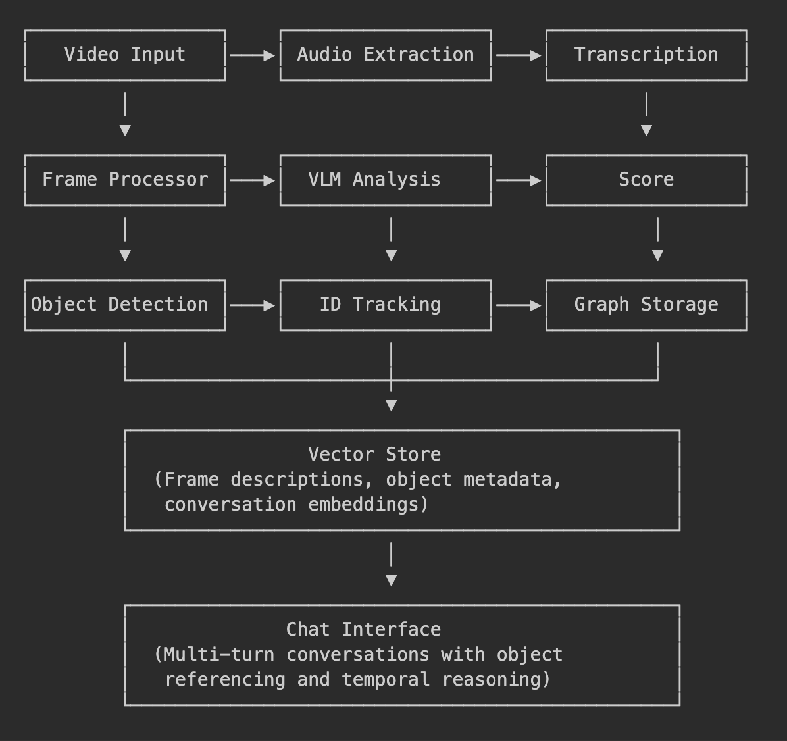

# Multimodal Video Chat Assistant

A sophisticated AI-powered system for intelligent video analysis, event recognition, and multi-turn conversational chat. This system processes videos efficiently to identify key moments, extract insights, and provide intelligent summarization across various domains including surveillance, educational content, podcasts, and general video analysis. 

**[IMPORTANT NOTE!!!]**

**Note:** For the testing, in the configuration file, the `fps_target` was set as 1. Set it to a higher number for better results. See the config information for more.

**Note:** For testing the smallest model of whisper was used. That didn't work properly (Bad Transcription). Set a higher size in the config for the correct transcript results. Same goes for Florence - 2 and Blip. Use Ollama based VLMs for better results but will increase thre processing time.

## 🎯 Features

- **Advanced Video Processing**: Handles 10-minute videos at 60 fps with efficient frame processing
- **Event Recognition**: Identifies key moments and specific events within video streams
- **Intelligent Summarization**: Extracts important segments from various video types (podcasts, educational content, surveillance footage)
- **Multi-turn Conversations**: Maintains context across conversation turns with memory capabilities
- **Object Tracking**: Real-time object detection and tracking using YOLO models
- **Temporal Reasoning**: Understands relationships between events across different time periods
- **Dual Interface**: Both command-line interface and web-based Gradio interface
- **VLM Integration**: Supports vision-language models for comprehensive video understanding

## 🏗️ Architecture



The system is built with a modular architecture consisting of:

- **Video Processing Engine**: Efficient frame extraction and analysis
- **Vision-Language Models**: For scene understanding and content analysis  
- **Vector Database**: Milvus-based storage for semantic search and retrieval
- **Graph Database**: NetworkX-based temporal relationship storage
- **Chat Memory**: Persistent conversation context management
- **Object Tracking**: YOLO-based real-time detection and tracking
- **Web API**: Flask-based REST API for integration
- **Web Interface**: Gradio-based user-friendly interface

## 📁 Project Structure

```
Mantra Softech/
├── main.py                              # Main CLI interface
├── server.py                           # Web server (Flask + Gradio)
├── requirements.txt                    # Python dependencies
├── README.md                          # This file
├── IMPLEMENTATION_PLAN.md             # Detailed implementation documentation
├── CLAUDE.md                          # Project guidance for AI assistants
├── Assignment_ Multimodal Chat Assistant.pdf # Original project requirements
│
├── tools/                             # Core processing modules
│   ├── enhanced_chatbot.py           # Main chatbot logic
│   ├── video_processor.py            # Video processing pipeline
│   ├── video_frame_processor.py      # Frame-level analysis
│   ├── object_tracker.py             # Object detection and tracking
│   ├── create_video_transcript.py    # Audio transcription
│   ├── chatbot.py                    # Basic chat functionality
│   ├── hf_models.py                  # HuggingFace model management
│   ├── load_video.py                 # Video loading utilities
│   └── utils/                        # Utility modules
│       ├── vector_store.py           # Milvus vector database
│       ├── graph_store.py            # NetworkX graph database
│       ├── video_cache.py            # Video processing cache
│       ├── chat_memory.py            # Conversation memory
│       └── embedding.py              # Text embedding utilities
│
├── config/                           # Configuration files
│   ├── config.yaml                   # Main configuration
│   ├── config_cctv.yaml             # CCTV-specific settings
│   ├── architecture                  # System architecture diagram
│   └── multimodal_chat_architecture_hd # High-definition architecture
│
├── sys_prompts/                      # System prompts
│   ├── frame_analysis_prompt.txt     # Frame analysis instructions
│   └── final_chatbot_prompt.txt      # Chatbot behavior instructions
│
├── models/                           # Pre-trained models
│   ├── yolo11n.pt                    # YOLO object detection model
│   └── yolov8s.pt                    # Alternative YOLO model
│
├── cache/                            # Processing cache
│   ├── metadata/                     # Metadata storage
│   └── [video transcripts and cache files]
│
├── data/                             # Data storage
├── uploads/                          # Upload directory
├── testing/                          # Test files and demos
│   ├── test_*.py                     # Various test scripts
│   ├── debug_vlm.py                  # VLM debugging tools
│   ├── app.py                        # Test Flask application
│   ├── gradio_app.py                 # Gradio interface implementation
│   ├── gradio_demo.py                # Gradio demo
│   ├── manage_cache.py               # Cache management tools
│   └── testing.ipynb                 # Jupyter notebook for testing
│
└── [database and cache files]
```

## 🚀 Quick Start

### Prerequisites

- Python 3.8+
- Ollama (for running local LLMs)
- CUDA-compatible GPU (recommended for optimal performance)

### Installation

1. **Clone the repository**:
   ```bash
   git clone <repository-url>
   cd "Mantra Softech"
   ```

2. **Install dependencies**:
   ```bash
   pip install -r requirements.txt
   ```

3. **Install Ollama and required models**:
   ```bash
   # Install Ollama (visit https://ollama.ai for platform-specific instructions)
   ollama pull gemma3:4b
   ollama pull mxbai-embed-large
   ```

4. **Verify installation**:
   ```bash
   python main.py --help
   ```

### Usage

#### Web Interface

**Start the web server** (Flask API + Gradio UI):
```bash
python server.py
```

Then access:
- **Gradio Interface**: http://localhost:7860
- **REST API**: http://localhost:5000

Gradio Interface to be used to use the chatbot.

## 🛠️ Configuration

### Main Configuration (config/config.yaml)

Specifically set the fps_target. This basically tells how many frames per second to be processed for the video. For example, when set to 1, it just processes 1 frame for 1 second of video. This might work efficiently for a podcast style video, but for a cctv style footage, you might increase the number. For ex. see the config_cctv.yaml. You can keep a higher number for all the videos in general.

```yaml
# Video processing
video:
  fps_target: 1.0 
  max_duration: 600
  resize_height: 480

# LLM settings
llm:
  model: "llama3.1:8b"
  temperature: 0.1
  context_length: 4096

# Vector database
vector_db:
  collection_name: "video_frames"
  dimension: 1024

# Object tracking
tracking:
  model: "yolo11n.pt"
  confidence_threshold: 0.5
```

### CCTV Configuration (config/config_cctv.yaml)

Optimized settings for surveillance footage with enhanced object tracking and event detection.

## 📊 Performance

- **Target Latency**: <2 seconds for query processing
- **Video Support**: Up to 10-minute videos at 60fps
- **Memory Efficiency**: Intelligent caching and frame sampling
- **Concurrent Processing**: Multi-threaded frame analysis

## 🧪 Testing

The `testing/` directory contains various test scripts and utilities:

```bash
# Run specific tests
cd testing
python test_implementation.py       # Core functionality tests
python test_frame_analysis.py      # Frame processing tests
python test_florence2.py           # Vision model tests
python debug_vlm.py                # Vision-Language Model debugging

# Interactive testing with Jupyter
jupyter notebook testing.ipynb
```

## 🔍 Supported Video Types

- **Educational Content**: Lectures, tutorials, presentations
- **Surveillance/CCTV**: Security footage, monitoring videos
- **Podcasts**: Audio-heavy content with visual elements
- **General Videos**: Any standard video format (MP4, AVI, MOV, etc.)

## 🔗 API Reference

### REST API Endpoints

- `POST /upload` - Upload video file
- `POST /chat` - Send chat message
- `GET /sessions` - List chat sessions
- `GET /sessions/{id}` - Get specific session
- `DELETE /sessions/{id}` - Delete session

### Gradio Interface

The web interface provides:
- Video upload and processing
- Real-time chat interface
- Session management
- Processing status monitoring

## 📋 Requirements

See `requirements.txt` for complete dependency list. Key dependencies include:

- **Video Processing**: OpenCV, MoviePy
- **AI/ML**: PyTorch, Transformers, LangChain
- **Database**: Milvus (vector), NetworkX (graph)
- **Web Framework**: Flask, Gradio
- **Audio**: OpenAI Whisper, Librosa

**Test Data**: Sample videos available at: https://drive.google.com/drive/folders/1RYil2fWSlkKsmf65CwSav3H4h5DDHikl